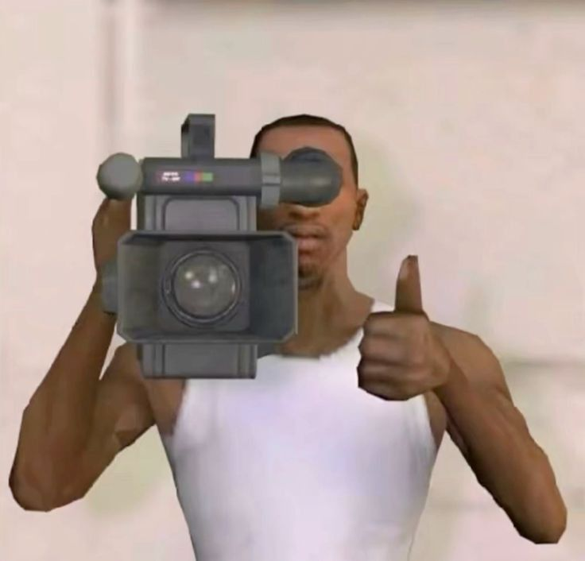
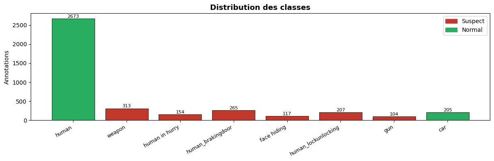
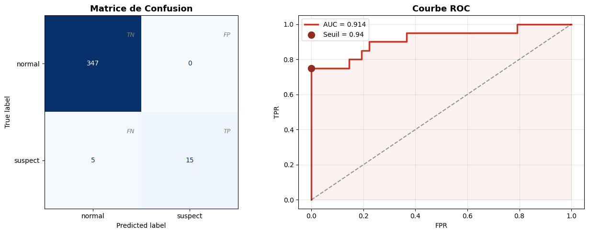
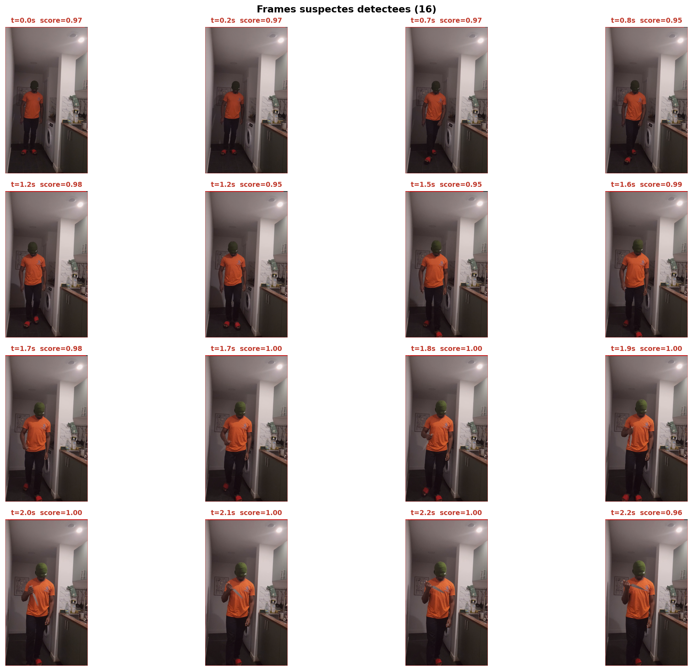
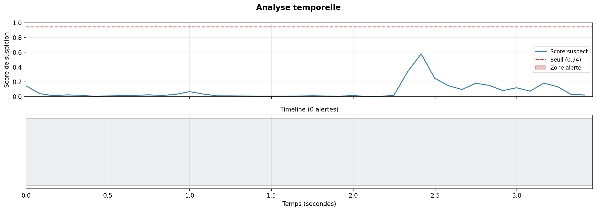

# Detection de Comportements Suspects avec CNN

> Analyse automatique de videos de surveillance par apprentissage profond — MobileNetV2 + Transfer Learning



---

## Resultats

| Metrique | Valeur |
|---|---|
| Accuracy | **99%** |
| AUC-ROC | **0.91** |
| Precision (suspect) | **100%** |
| Recall (suspect) | **75%** |
| Fausses alarmes (FP) | **0** |
| Suspects manques (FN) | **5 / 20** |

---

## Dataset

**Thief Detection Dataset** — Kaggle (`janstylewis7/thief-detection-dataset`)

| Split | Images | Labels |
|---|---|---|
| Train | 1 887 | 1 887 |
| Valid | 250 | 250 |
| Test | 227 | 227 |

**8 classes YOLO** regroupees en 2 labels binaires :

| Label | Classes |
|---|---|
| Normal (0) | `human`, `car` |
| Suspect (1) | `face hiding`, `gun`, `weapon`, `human in hurry`, `human_brakingdoor`, `human_lockunlocking` |



---

## Architecture

```
INPUT 96x96x3
  |
  +-- MobileNetV2 (pre-entraine ImageNet)
  |     Phase 1 : backbone gele
  |     Phase 2 : 30 dernieres couches degelees (lr = 1e-5)
  |
  +-- GlobalAveragePooling2D
  +-- Dense(256) -> BatchNorm -> ReLU -> Dropout(0.4)
  +-- Dense(1) -> Sigmoid
  |
OUTPUT  0 = normal | 1 = suspect
```


### Pourquoi MobileNetV2 et pas un CNN from scratch ?

Le CNN from scratch (v3) atteignait une AUC de 0.61 avec ~3 700 crops d'entrainement. Le modele devait apprendre simultanement les features visuelles de base et la tache de classification — trop peu de donnees pour converger correctement.

MobileNetV2 pre-entraine sur 1.2 million d'images ImageNet apporte deja les features visuelles (bords, textures, silhouettes). Seule la tete de classification est apprise from scratch.

---

## Pipeline

```
Videos de surveillance
        |
        v
Annotations YOLO (.txt)
  class_id  cx  cy  w  h
        |
        v
Extraction des crops (96x96, padding 5%, min 30px)
        |
        v
Labels binaires : suspect / normal
        |
        v
Augmentation conservative
  rotation 10°, flip, zoom 10%
        |
        v
Entrainement MobileNetV2 (2 phases)
        |
        v
Evaluation : AUC, Precision, Recall, F1
        |
        v
Inference video (resize frame -> 96x96 -> CNN -> score)
```

---

## Evaluation

### Matrice de confusion et Courbe ROC



### Evolution des resultats (v3 -> v5)

| Version | Modele | AUC | Accuracy |
|---|---|---|---|
| v3 | CNN scratch (64x64, 3 blocs) | 0.61 | 67% |
| v4 | CNN scratch (96x96, 4 blocs) | 0.72 | 67% |
| v5 | MobileNetV2 Transfer Learning | **0.91** | **99%** |

---

## Detection video


La frame entiere est redimensionnee en 96x96 et passee au CNN en une seule inference (~2ms/frame). Le seuil optimal calcule par la methode de Youden est **0.944**.

### Apercu des frames detectees



### Timeline des alertes



---

## Utilisation

### Prerequis

```bash
pip install kagglehub tensorflow opencv-python-headless scikit-learn matplotlib numpy Pillow
```

### Lancer le notebook

1. Ouvrir `TP_CNN_Detection_Voleurs_v5.ipynb` dans Google Colab
2. Activer le GPU : `Runtime > Change runtime type > T4 GPU`
3. Executer toutes les cellules dans l'ordre
4. A l'etape 9 : monter Google Drive et selectionner la video a analyser

### Detection webcam

Utiliser `TP_CNN_v5_webcam.ipynb` pour une capture en direct depuis la webcam du navigateur.

---

## Structure du projet

```
.
├── TP_CNN_Detection_Voleurs_v5.ipynb    # Notebook principal (video Drive)
├── 1            # Resultat du cas 1
├── 2            # Resultat du cas 2
.                # Resultat du cas 3
.
.               # Modele entraine sauvegarde
├── assets/
│   └── images/

└── README.md
```

---

## Technologies

| Outil | Usage |
|---|---|
| TensorFlow / Keras | Construction et entrainement du modele |
| MobileNetV2 | Backbone pre-entraine ImageNet |
| OpenCV | Lecture video, extraction crops, annotation frames |
| scikit-learn | Metriques, courbe ROC, class weights |
| kagglehub | Telechargement du dataset |
| Google Colab | Environnement d'execution GPU |

---
